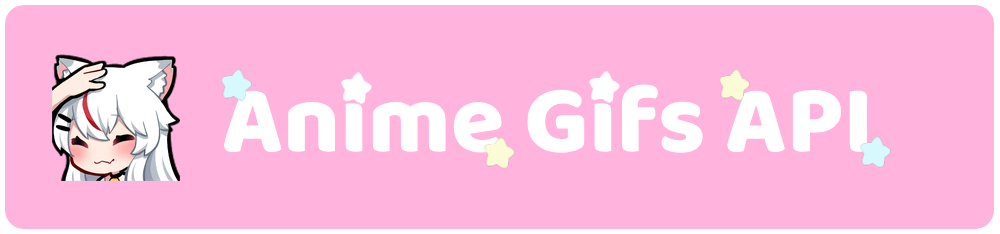

A free and open-source anime reaction GIF API :3

Every GIF is hand-picked and curated for quality: good resolution, nearly 16:9 aspect ratio, no bugged pixels and no annoying text. Each GIF includes the **anime name** in the response so you always know the source, and you can filter by **gender pairing** (girl x girl, boy > girl, etc.) which is something no other anime GIF API offers ^^

GIFs are stored on Cloudflare R2 and served via `cdn.gifukai.com`. The API is built with Go and uses Turso (libSQL) as the database.

Full documentation coming soon at [gifukai.com](https://gifukai.com).

## How to use

```
GET https://api.gifukai.com/hug
```

Returns a random GIF for the given action. No API key, no signup, no rate limits ^^

## Actions

| Action  | Endpoint                      |
| ------- | ----------------------------- |
| `pat`   | https://api.gifukai.com/pat   |
| `hug`   | https://api.gifukai.com/hug   |
| `kiss`  | https://api.gifukai.com/kiss  |
| `cry`   | https://api.gifukai.com/cry   |
| `sleep` | https://api.gifukai.com/sleep |

You can get the full list of actions from `GET /actions`

## Pairing filter

You can filter GIFs by pairing type using the `pairing` query parameter. The first character represents who **does** the action:

| Pairing | Description | Example                                 |
| ------- | ----------- | --------------------------------------- |
| `f`     | Solo girl   | https://api.gifukai.com/sleep?pairing=f |
| `m`     | Solo boy    | https://api.gifukai.com/sleep?pairing=m |
| `ff`    | Girl > Girl | https://api.gifukai.com/hug?pairing=ff  |
| `mm`    | Boy > Boy   | https://api.gifukai.com/hug?pairing=mm  |
| `fm`    | Girl > Boy  | https://api.gifukai.com/kiss?pairing=fm |
| `mf`    | Boy > Girl  | https://api.gifukai.com/kiss?pairing=mf |

If no pairing is specified, a random GIF from any pairing will be returned.

## Other endpoints

| Endpoint                      | Description                                           |
| ----------------------------- | ----------------------------------------------------- |
| `GET /actions`                | List all available actions                            |
| `GET /actions/{action}/count` | Count GIFs for an action (with per-pairing breakdown) |
| `GET /stats`                  | Total GIFs, actions, animes and size                  |
| `GET /library`                | Browse GIFs with filters (action, pairing, anime)     |
| `GET /healthz`                | Health check                                          |

## Example response

`GET /pat`

```json
{
  "action": "pat",
  "pairing": "mf",
  "url": "https://cdn.gifukai.com/pat/f392b436-e889-4542-8b97-7b11c7d005f6.gif",
  "filename": "f392b436-e889-4542-8b97-7b11c7d005f6.gif",
  "content_type": "image/gif",
  "size_bytes": 577909,
  "anime_name": "Date A Live"
}
```

Thank you for using the API! If you have any suggestions, please let me know :3